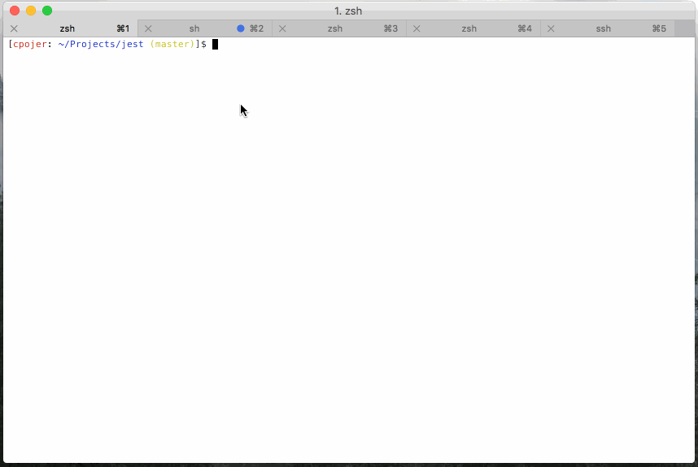

# Running Tests

> Note: this feature is available with `react-scripts@0.3.0` and higher.

> [Read the migration guide to learn how to enable it in older projects!](https://github.com/facebook/create-react-app/blob/main/CHANGELOG-0.x.md#migrating-from-023-to-030)

Create React App uses [Jest](https://jestjs.io/) as its test runner. To prepare for this integration, we did a [major revamp](https://jestjs.io/blog/2016/09/01/jest-15) of Jest so if you heard bad things about it years ago, give it another try.

Jest is a Node-based runner. This means that the tests always run in a Node environment and not in a real browser. This lets us enable fast iteration speed and prevent flakiness.

While Jest provides browser globals such as `window` thanks to [jsdom](https://github.com/jsdom/jsdom), they are only approximations of the real browser behavior. Jest is intended to be used for unit tests of your logic and your components rather than the DOM quirks.

We recommend that you use a separate tool for browser end-to-end tests if you need them. They are beyond the scope of Create React App.

## Filename Conventions

Jest will look for test files with any of the following popular naming conventions:

- Files with `.js` suffix in `__tests__` folders
- Files with `.test.js` suffix.
- Files with `.spec.js` suffix

The `.test.js` / `.spec.js` files (or the `__tests__` folders) can be located at any depth under the `src` top level folder.

We recommend to put the test files (or `__tests__` folders) next to the code they are testing so that relative imports appear shorter. For example, if `App.test.js` and `App.js` are in the same folder, the test only needs to `import App from './App'` instead of a long relative path. Collocation also helps find tests more quickly in larger projects.

## Command Line Interface

When you run `npm test`, Jest will launch in watch mode\*. Every time you save a file, it will re-run the tests, like how npm start recompiles the code.

The watcher includes an interactive command-line interface with the ability to run all tests, or focus on a search pattern. It is designed this way so that you can keep it open and enjoy fast re-runs. You can learn the commands from the “Watch Usage” note that the watcher prints after every run:



> \*Although we recommend running your tests in watch mode during development, you can disable this behavior by passing in the `--watchAll=false` flag. In most CI environments, this is handled for you (see [On CI servers](#on-ci-servers)).

## Version Control Integration

By default, when you run `npm test`, Jest will only run the tests related to files changed since the last commit. This is an optimization designed to make your tests run fast regardless of how many tests you have. However it assumes that you don’t often commit the code that doesn’t pass the tests.

Jest will always explicitly mention that it only ran tests related to the files changed since the last commit. You can also press `a` in the watch mode to force Jest to run all tests.

Jest will always run all tests on a [continuous integration](#continuous-integration) server or if the project is not inside a Git or Mercurial repository.

## Writing Tests

To create tests, add `it()` (or `test()`) blocks with the name of the test and its code. You may optionally wrap them in `describe()` blocks for logical grouping but this is neither required nor recommended.

Jest provides a built-in `expect()` global function for making assertions. A basic test could look like this:

```js
import sum from "./sum";

it("sums numbers", () => {
  expect(sum(1, 2)).toEqual(3);
  expect(sum(2, 2)).toEqual(4);
});
```

All `expect()` matchers supported by Jest are [extensively documented here](https://jestjs.io/docs/expect).

You can also use `jest.fn() and expect(fn).toBeCalled()` to create “spies” or mock functions.

## Testing Components

There is a broad spectrum of component testing techniques. They range from a “smoke test” verifying that a component renders without throwing, to shallow rendering and testing some of the output, to full rendering and testing component lifecycle and state changes.

Different projects choose different testing tradeoffs based on how often components change, and how much logic they contain. If you haven’t decided on a testing strategy yet, we recommend that you start with creating basic smoke tests for your components:

```js
import React from "react";
import ReactDOM from "react-dom";
import App from "./App";

it("renders without crashing", () => {
  const div = document.createElement("div");
  ReactDOM.render(<App />, div);
});
```

This test mounts a component and makes sure that it didn’t throw during rendering. Tests like this provide a lot of value with very little effort so they are great as a starting point, and this is the test you will find in `src/App.test.js`.

When you encounter bugs caused by changing components, you will gain a deeper insight into which parts of them are worth testing in your application. This might be a good time to introduce more specific tests asserting specific expected output or behavior.

## React Testing Library

If you’d like to test components in isolation from the child components they render, we recommend using `react-testing-library`. [react-testing-library](https://github.com/testing-library/react-testing-library) is a library for testing React components in a way that resembles the way the components are used by end users. It is well suited for unit, integration, and end-to-end testing of React components and applications. It works more directly with DOM nodes, and therefore it's recommended to use with `jest-dom` for improved assertions.

To install `react-testing-library` and `jest-dom`, you can run

```sh
npm install --save @testing-library/react @testing-library/jest-dom
```

Alternatively you may use `yarn`:

```sh
yarn add @testing-library/react @testing-library/jest-dom
```

If you want to avoid boilerplate in your test files, you can create a [`src/setupTests.js`](#initializing-test-environment) file:

```js
// react-testing-library renders your components to document.body,
// this adds jest-dom's custom assertions
import "@testing-library/jest-dom";
```

Here's an example of using `react-testing-library` and `jest-dom` for testing that the `<App />` component renders "Learn React".

```js
import React from "react";
import { render, screen } from "@testing-library/react";
import App from "./App";

it("renders welcome message", () => {
  render(<App />);
  expect(screen.getByText("Learn React")).toBeInTheDocument();
});
```

Learn more about the utilities provided by `react-testing-library` to facilitate testing asynchronous interactions as well as selecting form elements from the [react-testing-library documentation](https://testing-library.com/docs/react-testing-library/intro/) and [examples](https://codesandbox.io/s/github/kentcdodds/react-testing-library-examples?file=/src/__tests__/mock.react-router.js).
